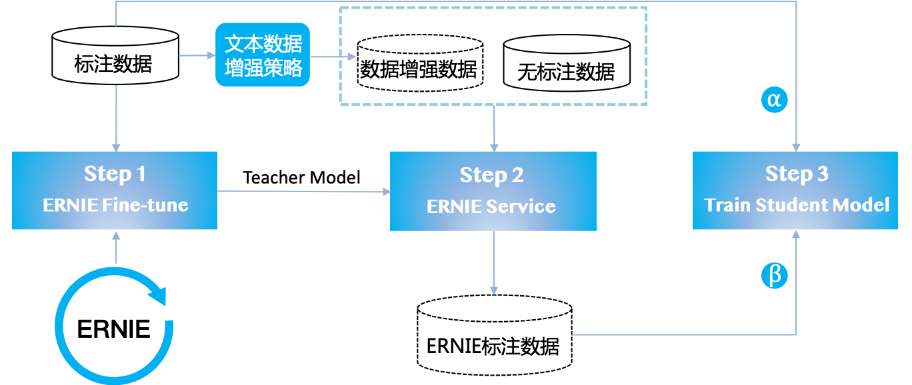

* [ERNIE Slim 数据蒸馏](#ernie-slim-数据蒸馏)
    * [ERNIE数据蒸馏三步](#ernie数据蒸馏三步)
    * [数据增强](#数据增强)
* [使用教程](#使用教程)
* [效果验证](#效果验证)
    * [Case#1 用户提供“无标注数据”](#case1)
    * [Case#2 用户未提供“无标注数据”](#case2)
* [FAQ](#faq)

# ERNIE Slim 数据蒸馏
在ERNIE强大的语义理解能力背后，是需要同样强大的算力才能支撑起如此大规模模型的训练和预测。很多工业应用场景对性能要求较高，若不能有效压缩则无法实际应用。



因此，如上图所示，我们基于[数据蒸馏技术](https://arxiv.org/pdf/1712.04440.pdf)构建了**ERNIE Slim数据蒸馏系统**。它的原理是通过数据作为桥梁，将ERNIE模型的知识迁移至小模型，以达到损失很小的效果却能达到上千倍的预测速度提升的效果。


### ERNIE数据蒸馏三步

 - **Step 1**. 使用ERNIE模型对输入标注数据对进行fine-tune，得到Teacher Model
 - **Step 2**. 使用ERNIE Service对以下无监督数据进行预测：
 
   1. 用户提供的大规模无标注数据，需与标注数据同源
   2. 对标注数据进行数据增强，具体增强策略见下节
   3. 对无标注数据和数据增强数据进行一定比例混合 
   
 - **Step 3.** 使用步骤2的数据训练出Student Model


### 数据增强
目前采用三种[数据增强策略](https://arxiv.org/pdf/1903.12136.pdf)策略，对于不用的任务可以特定的比例混合。三种数据增强策略包括：

 1. 添加噪声：对原始样本中的词，以一定的概率（如0.1）替换为”UNK”标签
 2. 同词性词替换：对原始样本中的所有词，以一定的概率（如0.1）替换为本数据集钟随机一个同词性的词
 3. N-sampling：从原始样本中，随机选取位置截取长度为m的片段作为新的样本，其中片段的长度m为0到原始样本长度之间的随机值


# 使用教程

我们采用上述3种增强策略制作了chnsenticorp的增强数据：增强后的数据为原训练数据的10倍(96000行)，可以从[这里](https://ernie.bj.bcebos.com/distill_data.tar.gz)下载。即可执行下面的脚本开始蒸馏。

```shell
python ./distill/distill.py
```

# 效果验证
我们将实际应用场景分类为两种：

### Case#1 用户提供“无标注数据”<a name="case1"></a>

|模型 | 评论低质识别【分类 \| ACC】 | 中文情感【分类 \| ACC】 |问题识别【分类 \| ACC】|搜索问答匹配【匹配 \| 正逆序】|
|---|---|---|---|---|
|ERNIE-Finetune | 90.6% | 96.2% | 97.5% | 4.25 |
|非ERNIE基线（BOW）| 80.8% | 94.7% | 93.0% | 1.83 |
|**+ 数据蒸馏** | 87.2% | 95.8% | 96.3% | 3.30 |

### Case#2 用户未提供“无标注数据”（通过数据增强生成数据）<a name="case2"></a>

|模型 |ChnSentiCorp |
|---|---|
|ERNIE-Finetune |95.4% |
|非ERNIE基线(BOW)|90.1%|
|**+ 数据蒸馏** |91.4%| 
|非ERNIE基线（LSTM）|91.2%|
|**+ 数据蒸馏**|93.9%|

# FAQ

### FQA1: 预测同时蒸馏报错：`Client call failed`

终端打印的错误是client的日志，server端的日志在前面。一般来说可能是server显存超限导致。这种时候需要在student模型finetune的脚本中使用`--server_batch_size ` 显示控制请求服务的batch大小。
